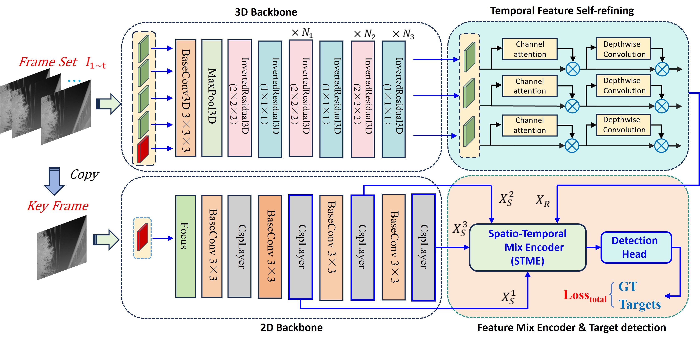

# STMENet
The Pytorch implementation of the our paper of UESTC-nnLab [**Moving Infrared Dim and Small Target Detection by
Spatio-temporal Mixed Encoding**]


## Abstract
Infrared dim and small target detection has become a challenging and hot topic
in recent years. Due to the extremely small pixels and low intensity of targets,
the existing methods based on single frame seldom consider the temporal relationship between frames, thus often resulting in poor detection performance. Moreover, unlike general objects, the detection task suffers from an overwhelming amount of background information. Usually, directly employing inter-frame attention mechanisms or Convolutional Long Short Term Memory would introduce excessive interfering information and computational load. To advance the detection of infrared dim and small targets and enhance the application of artificial intelligence techniques in this field, this paper explores an artificial intelligence-based method for spatio-temporal feature fusion, which is prevalent in the video domain. Simply but effectively, we propose a Spatio-temporal Mixed Encoding Network (STMENet) for infrared target detection, based on feature
fusion principles. It consists of two parallel feature extraction branches. One is designed to extract temporal features across entire video clip, and the other is designed to isolate spatial features from a selected key frame. Following this, a self-refining module is adopted to adaptively adjust the extracted temporal features and fusing spatio-temporal features at different scales, enhancing target feature representation. The experiments on two public datasets validate our method simple yet effective. It could reduce floating point operations per
second (FLOPs) obviously, promote inference speed, and achieve superior detection accuracy, in comparison to state-of-the-art (SOTA) methods.
## Datasets
-You can download them directly from the website: [DAUB](https://www.scidb.cn/en/detail?dataSetId=720626420933459968), [ITSDT-15K](https://www.scidb.cn/en/detail?dataSetId=de971a1898774dc5921b68793817916e&dataSetType=journal), [IRDST](https://xzbai.buaa.edu.cn/datasets.html). You can also directly download the organized version of our paper. [ITSDT-15K](https://drive.google.com/file/d/1nnlXK0QCoFqToOL-7WdRQCZfbGJvHLh2/view?usp=sharing). 
- The COCO format json file needs to be converted into a txt format file. 
```
python utils_coco/coco_to_txt.py
```
## Usage
### Train
```
CUDA_VISIBLE_DEVICES=0 python train_{dataset}.py
```
### Test
- Usually model_best.pth is not necessarily the best model. The best model may have a lower val_loss or a higher AP50 during verification.
```
CUDA_VISIBLE_DEVICES=0 python vid_map_coco_{dataset}.py
```
### Comparision method
-We also provide comparison methods that include an added detection head. The trained models and results on the ITSDT-15K dataset are available at: (https://pan.baidu.com/s/1c-6LyuUDiV360fkuJRlPSQ?pwd=5vjn)(code:5vjn) 
-You can verify the effectiveness of our trained single-frame-based methods as follows::
```
CUDA_VISIBLE_DEVICES=0 python vid_map_ITDST_single.py
```
## Results

- PR curve on DAUB and IRDST datasets.
- We provide the results on [ITSDT-15K](./readme/ITDST_results) and [IRDST](./readme/IRDST_results), and you can plot them using Python.


## Contact
IF any questions, please contact with Shuang Peng via email: [shuangpeng@std.uestc.edu.cn]().